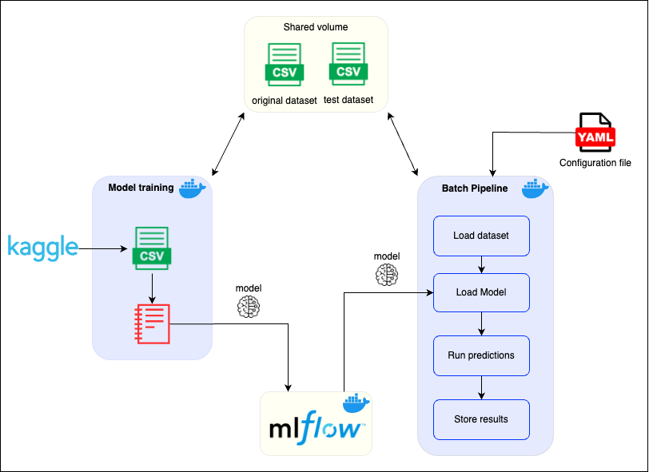
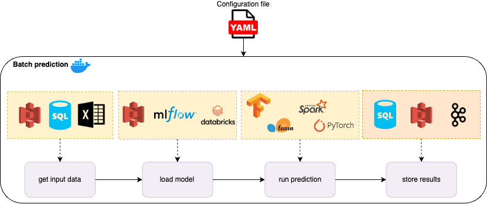

# mlops-demo-case
MLOps demo case

The purpose of this project is to create a simple generic pipeline to run batch prediction for machine learning models.

## 1. Project structure

### src
python code that loads the data, the model, runs the predictions and save them. The idea is to support different flavors of data input, model type, and data output. This version supports the following flavors
* data input: local file. (future versions could implement s3 input, sql query, etc)
* model type: MLFlow sklearn model. (future versions could implement MLFLow Spark, Pytorch, etc. or not using MLFlow at all)
* data output: local storage. (future version could implement kafka output, SQL database, etc.)
The batch pipeline runs in a docker container and expects a yaml file to set the parameters of the pipeline

### use_case
This is an example of use case for this batch predictor. It basically trains a very simple model based on [Brazilian Credit Card Spending](https://www.kaggle.com/datasets/sufyant/brazilian-real-bank-dataset) dataset from Kaggle. After training the model, log the trained model to MLFlow to be used later by the batch prediction pipeline. The whole process is wrapped in a docker container for convenience.

### docker-compose
This docker compose, starts the MLFLow server, runs the training pipeline, and then it runs the batch prediction pipeline

### config.yaml
Configuration file to set the parameters of the batch process to the image.

## 2. Assumptions
* Assumed that the predictions run in batch

## 3. Disclaimers
* The model trained in `use_case/model_training` couldn't be any simpler, a made it very simple so I could focus on the batch pipeline
* The model pipeline is wrapped in a docker container just for convenience. It would be a good idea to use Docker for training anyway, considering reproducibility, retraining, etc. But that wasn't part of the project scope.
* Docker compose is used here just for convenience. It's running the training and prediction pipelines all together to keep the project simple. Ideally, the batch pipeline could run and schedule the execution in platforms like Kubernetes, Airflow, etc.
* In this project I managed to wrap all the data transformation within the sklearn pipeline object that was stored in MLFlow, but in some cases it wouldn't be possible or convenient to do it, in that case would be required to implement a way to provide the transformations files to the batch pipeline so it can run the transformations before making the predictions.

## 4. How to run the use case example

The image below shows an overview of everything is working along with docker compose:



### requirements
* docker installed

### steps before running docker compose
* Set variables in `.env` and `use_case/.env`
* Most of the variables are already set, the only ones that might be required to set are `KAGGLE_USER` and `KAGGLE_KEY` in `use_case/.env`. These variables are required to download the dataset from Kaggle. In case you don't have Kaggle credentials, you can manually download the dataset and place it in `use_case/data` and it will ignore the download step

### running docker compose
 ```console
 docker compose --env-file 'use_case/.env' up --build
 ```

 ### What are the results?
 * You can check the experiment in http://localhost:5001. You can click in the `example-use-case` experiment and check the metrics, model, and artifacts for the experiment
 * The predictions will be stored in the directory `./data`

## 5. How to run the batch pipeline with different models
To run the batch pipeline manually with different models the following steps are required:

* The project assumes the model is stored in MLFlow, thus you need to train the model and log it to MLFlow. In case you don't want to use MLFlow for it, you can implement a different predictor in `src/pipeline`
* create a config.yaml to set the pipeline parameters.

### Pipeline parameters
|parameter|description|required|default|
|---------|-----------|--------|-------|
|model|model parameters|true||
|model:type|model type {MLFlow}|true||
|model:params|model parameters forward to the predictor|true||
|data|data (input/output) configuration|true||
|data:source|data source, from where the input data comes from|true||
|data:source:type|data source type {local_file_source}|true||
|data:source:params|params forward to the data source class|false|{}|
|data:target|data target, where the predictions are stored to|true||
|data:target:type|data target type {local_file_target}|true||
|data:target:params|params forward to the data target class|false|{}|

## 6. What's next?

The idea is to create a generic pipeline that suports different types of data and models out of the box, while also providing the user with the possibility to define custom classes for each stage of the pipeline

the image bellow shows the overview of how it would look like:



## 7. Design of solution for future pipeline requirements

How would the design of the pipeline would change if:
* predictions needed to be produced in real time (1s per file): It would depend on how frequently new files become available for predictions. In case they are continuously created during the day, I would considering change the approach for a real time serving, eg using a API to serve the model, this project can ilustrate how it would look like [andre1393/fashion-mnist](https://github.com/andre1393/fashion-mnist). Otherwise, I would keep the batch approach and consider a few things that can optimize the predictions, like using proper tool for large data processing eg Spark, and paralelize the workload in different workers/instances.
* The model had to be retrained on a regular basis taking into account user feedback: Parameterizing the model training script might be helpful for this purpose. For example, parameterizing the model data input in a way that is possible to easily fetch new data and log all relevant parameters of the model during the training script. With that, is possible to automate the training of the model with new data and just manually analyse the recently trained metrics (on MLFlow) and decide to deploy the new version or not.
* Different versions of the model could bbe trained and served on a self-served manner: The pipeline is already design to work on a self-served manner, cause the user only have to provide a configuration file for the specific use case in order to setup the pipeline. Since it's running on a docker container, the user could easily create different configuration files for each version and run then using any kind of deployment (like Kubernetes)
